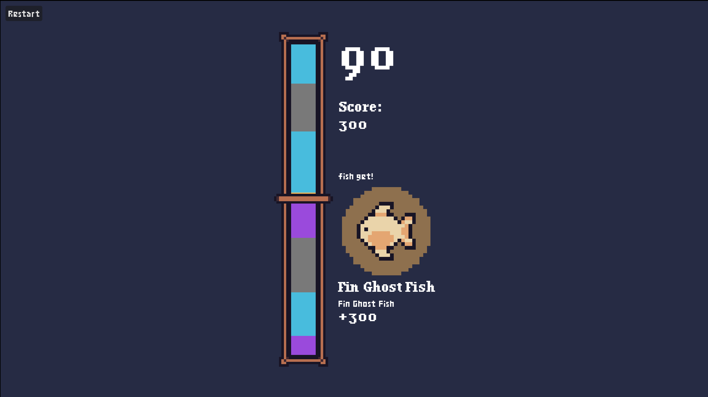

# 🎣 COGS Fishing

A fishing game that tests your reaction skills! This game is used to give out prizes at events.

## Developing

This game is made in Godot 4.4. 

You can add new fishes by creating a custom `Fish` resource in the `res://fish` folder. Fish images can be stored under `res://assets/art/fish`. After adding a new fish, make sure it's added to the fishes list inside the `FishSettings` node in the `main.tscn`.